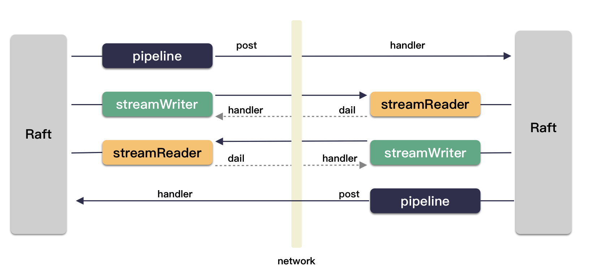

[toc] 

代码目录位于：etcd/etcdserver/api/rafthttp/

# raftexample 网络创建

之前说到，在 raftNode 的 startRaft 方法中创建了 transport ，这个是底层的网络模块，负责封装网络的数据传输，是非常重要，非常基础的模块。

```go
func (rc *raftNode) startRaft() {

    // 创建被节点的 transport （网络传输层）
    // 注意：这里传入了 raftNode（因为要业务定制网络消息的处理 Process 接口）
    rc.transport = &rafthttp.Transport{
        Logger:      zap.NewExample(),
        ID:          types.ID(rc.id),
        ClusterID:   0x1000,
        Raft:        rc,
        ServerStats: stats.NewServerStats("", ""),
        LeaderStats: stats.NewLeaderStats(strconv.Itoa(rc.id)),
        ErrorC:      make(chan error),
    }
    rc.transport.Start()
    for i := range rc.peers {
        // 初始化和集群其他节点通信的通道（本节点不初始化）
        if i+1 != rc.id {
            rc.transport.AddPeer(types.ID(i+1), []string{rc.peers[i]})
        }
    }
    // 开启两个服务；
    // 一个服务是 tcp server 的服务，这个是网络通道，走内部 raft 数据流的
    go rc.serveRaft()
    // 另一个则是 channel 消息的处理，真正核心的定制，处理 proposeC，confChangeC，commitC，errorC 这四个通道
    go rc.serveChannels()
}
```

上面表示的 startRaft 方法内部有两个跟网络相关的重要逻辑是：

1. 创建网络通信层；
    1. 并传入 raftNode 作为网络消息的地址处理；
2. 开启两个内部处理子协程，一个是处理网络消息，一个是处理业务 channel ；

## raftNode.serveRaft

这个方法是偏底层的，主要是构建 raft 通信的数据通道。

```go
func (rc *raftNode) serveRaft() {
    // 解析出地址
    url, err := url.Parse(rc.peers[rc.id-1])
    if err != nil {
        log.Fatalf("raftexample: Failed parsing URL (%v)", err)
    }
    // 定制一个 listener
    ln, err := newStoppableListener(url.Host, rc.httpstopc)
    if err != nil {
        log.Fatalf("raftexample: Failed to listen rafthttp (%v)", err)
    }
    // 创建出一个 http server，用于走 raft 数据流
    err = (&http.Server{Handler: rc.transport.Handler()}).Serve(ln)
    select {
    case <-rc.httpstopc:
    default:
        log.Fatalf("raftexample: Failed to serve rafthttp (%v)", err)
    }
    close(rc.httpdonec)
}
```

## newStoppableListener

先说 newStoppableListener 这个函数，这个函数定义在 raftexample/listener.go 这个文件，也是属于业务的一个实现。

返回一个定制了 Accept 的监听对象 stoppableListener 。为什么要专门定制一下 Accept ？

为了简单支持两个功能：

1. 停服（外层可以控制停服，因为 stopc 是传进来的）；
2. 网络设置（比如一些保活的设置）

并且注意到，http server 在初始化的时候，还初始化了一个 Handler：

```go
http.Server{Handler: rc.transport.Handler()}
```

相当于定制了下 http 的入口处理函数。那这个 Handler 会是什么样子的呢？

这个要稍后深入 transport 学习。这里可以先提一下，简单来说就是创建四个对应的处理通道（ path ）：

- /raft ：pipelineHandler ，数据传输通道，非长链接，每一次请求都是一个完整 http 请求。
- /raft/probing ：probing.NewHandler() ，心跳路径
- /raft/stream ：streamHandler ，数据传输通道，长链接
- /raft/snapshot ：snapHandler ，快照传输路径

## 网络层级关系

先简单看一下网络的封装层级关系：

```sh
-> transport
    -> peer
        -> pipeline 
        -> stream 
            -> stream msgappv2
            -> stream message
```

# transport 

## 定义

网络操作界面：

```go
Transporter interface {
    // 启动
	Start() error
	// 提供路由表处理
	Handler() http.Handler
	// 网络消息发送
	Send(m []raftpb.Message)
	// 发送快照
	SendSnapshot(m snap.Message)
	// 新加节点
	AddRemote(id types.ID, urls []string)
	// 初始化 raft 集群网络节点
	AddPeer(id types.ID, urls []string)
    // 更新
	RemovePeer(id types.ID)
	RemoveAllPeers()
	UpdatePeer(id types.ID, urls []string)
	ActiveSince(id types.ID) time.Time
	ActivePeers() int
	Stop()
}
```

具体实现 Transport ：

```go
// etcd/etcdserver/api/rafthttp/transport.go
type Transport struct {
	ID          types.ID   // 本地节点 id
	URLs        types.URLs // 本地节点的 url
	ClusterID   types.ID   // raft cluster ID for request validation
	Raft        Raft       // 状态机的处理方法（网络消息到了之后，会调用这个的 Process）
	peers   map[types.ID]Peer    // 其他节点的通信对象
}
```

可以看出来 transport 本身就是对底层的网络封装，这里的封装主要是给业务提供了同一个网络操作界面。

## AddPeer

这个接口就是外部调用初始化网络节点的接口，raftexample 就用这个来创建跟集群每一个节点的通信结构。

```go
// id 是节点的索引，表示第几个节点
// us 是节点网络地址
func (t *Transport) AddPeer(id types.ID, us []string) {
	// 其他节点的 url 地址
	urls, err := types.NewURLs(us)

	// 创建网络节点对象
	t.peers[id] = startPeer(t, urls, id, fs)
}
```

## http 路由注册

这个必须看下 transport 的 Handler 方法：

```go
// etcd/etcdserver/api/rafthttp/http.go

// 变量定义
var (
    RaftPrefix         = "/raft"
    ProbingPrefix      = path.Join(RaftPrefix, "probing")
    RaftStreamPrefix   = path.Join(RaftPrefix, "stream")
    RaftSnapshotPrefix = path.Join(RaftPrefix, "snapshot")
)

// 关键所在
func (t *Transport) Handler() http.Handler {
    // 处理逻辑对象
    pipelineHandler := newPipelineHandler(t, t.Raft, t.ClusterID)
    streamHandler := newStreamHandler(t, t, t.Raft, t.ID, t.ClusterID)
    snapHandler := newSnapshotHandler(t, t.Raft, t.Snapshotter, t.ClusterID)
    // http 路由注册
    mux := http.NewServeMux()
    mux.Handle(RaftPrefix, pipelineHandler)
    mux.Handle(RaftStreamPrefix+"/", streamHandler)
    mux.Handle(RaftSnapshotPrefix, snapHandler)
    mux.Handle(ProbingPrefix, probing.NewHandler())
    return mux
}
```

相当于给 /raft ，/raft/probing ，/raft/stream ，/raft/snapshot 这四个路径分别注册了四个处理逻辑。

- /raft ：pipelineHandler ，数据传输通道，非长链接，每一次请求都是一个完整 http 请求。
- /raft/probing ：probing.NewHandler() ，心跳路径
- /raft/stream ：streamHandler ，数据传输通道，长链接
- /raft/snapshot ：snapHandler ，快照传输路径

分别去看这四个 handler 定制的 ServeHTTP 方法就知道里面做啥了。

pipeline 通道通过 HTTP POST 发送给对端，stream 通道和对端维护一个长连接。


# Peer

```go
type peer struct {
    // 本节点 ID
    localID types.ID
    // 对端节点 ID
    id types.ID
    // raft 业务处理（ 比如 raftNode ）
    r Raft
    // 数据通道选取器
    picker *urlPicker

    // 流通道：写通道（两种流格式）
    msgAppV2Writer *streamWriter
    writer         *streamWriter
    // 流通道：读通道（两种流格式）
    msgAppV2Reader *streamReader
    msgAppReader   *streamReader

    // 数据包通道
    pipeline       *pipeline
    snapSender     *snapshotSender // snapshot sender to send v3 snapshot messages
    // 这两个 channel 是给底下数据通道用的，收到数据的时候怎么递交给上层？就用这个 channel 就行
    recvc chan raftpb.Message
    propc chan raftpb.Message
}
```

这个是对一个网络节点的抽象，配合 Transport 一起用的。在 transport 中以一个节点 map 的形式存在：

```go
type Transport struct {
    // ...
    peers   map[types.ID]Peer    // peers map（存储其他节点的通信对象）
}
```

peer 结构里面有两个 channel 这个都是为了接收数据用的，这两个 channel 是给底层 stream 准备的，底层 stream 收到数据的时候就是放到这里。

原则是：谁要数据，谁负责准备好 channel 。所以发送的时候，则是投递到底层准备好的 channel 里。

那为什么会准备两个 channel 呢？按道理一个不就行了？

这里是考虑到 pro 消息的实效性，避免和其他类消息混在一起，阻塞整个系统的吞吐。

数据要发给某个节点，则先把这个节点对应的 Peer 结构体找到，然后调用 peer.send(m) 来发送网络数据：

```go
func (t *Transport) Send(msgs []raftpb.Message) {
    // 找到 peer 
    p, pok := t.peers[to]
    if pok {
        // 发送数据
        p.send(m)
    }
}
```

## peer.send

peer 其实本身也是对更底层的模块的封装，更底层的模块就是 pipeline，stream 的这样的数据通道的抽象。

```go
func (p *peer) send(m raftpb.Message) {
    // 选一个数据通道
	writec, name := p.pick(m)
	select {
    // 数据投递 channel ，切协程处理；
	case writec <- m:
	default:
    }
}
```

writec 这个 channel 可能就是 pipeline 或 stream 或 snap 等通道，网络消息投递进去，就是等底下的模块来消费，然后发送了。

## peer.pick

pipeline，stream 都是网络通道，在 peer.pick 中选取：

```go
func (p *peer) pick(m raftpb.Message) (writec chan<- raftpb.Message, picked string) {
    var ok bool
    // 考虑到快照消息可能具有非常大的 body，比如 1G，如果使用 stream 通道，那么会阻塞整个系统，所以一般是选取 pipeline 通道。
    if isMsgSnap(m) {
        return p.pipeline.msgc, pipelineMsg
    } else if writec, ok = p.msgAppV2Writer.writec(); ok && isMsgApp(m) {
        return writec, streamAppV2
    } else if writec, ok = p.writer.writec(); ok {
        return writec, streamMsg
    }
    return p.pipeline.msgc, pipelineMsg
}
```

为什么会出现多通道？

其实是为了应付不同的需求场景。

主要考虑以下几个方面：

1. Snap 快照消息走 pipeline 通道，因为 body size 可能非常大；
2. Append 消息走 streamMsgAppV2 通道，因为此时 raft 集群已经稳定，长链接效率高；
3. 其他消息走 streamMsg 通道 ；

如果 stream 通道不可用，则使用 pipeline 发送消息。

接下来看两个最重要的数据通道：pipeline 和 stream 。



## 通道是怎么分开的呢？

对于这两种 stream 通道，其实代码都是用 streamWriter，streamReader 封装起来。在内部有类型判断 .

peer

```go
type peer struct {
    msgAppV2Writer *streamWriter    // stream msgappv2 的通道
    msgAppV2Reader *streamReader    // 

    writer         *streamWriter    // stream message 的通道
    msgAppReader   *streamReader    // 
}
```

可以看到无论是 stream msgappv2 还是 stream message 都是 ( streamWriter , streamReader ) 这两个配套的 .

类型在 stream 的内部实现, 按照不同的 type 使用了不同的 encoder/decoder .

当建链接的时候 ( attachOutgoingConn ) , 根据连接的类型, 划分到不同的 streamwriter 里去. 发起端是通过 path 来区分的 .

```go

func (h *streamHandler) ServeHTTP(w http.ResponseWriter, r *http.Request) {

    // 根据 path 识别通道类型
    switch path.Dir(r.URL.Path) {
    case streamTypeMsgAppV2.endpoint():
        t = streamTypeMsgAppV2
    case streamTypeMessage.endpoint():
        t = streamTypeMessage

    // 创建对应的 connection 结构体
    conn := &outgoingConn{
    }
    // 添加到网络层管理
    p.attachOutgoingConn(conn)
}
```

# pipeline

# stream

## stream 数据格式

对于一个长连接，数据是流式的，那么数据包在业务层一定是具备独立格式的，msgappv2 stream 里面流淌这三种格式的数据：

1. linkHeartbeatMessage 心跳数据，这种就一个字节，值为 0x0 ，标识是心跳类型；
2. AppEntries 这种头部字节为 0x1，后面的为具体的 entry 格式；
3. MsgApp 消息这种头部标识为 0x2，然后一个长度，后续为 payload 数据；

数据流格式定义：

```go
// 文件 msgappv2_codec.go 

// msgappv2 stream sends three types of message: linkHeartbeatMessage,
// AppEntries and MsgApp. AppEntries is the MsgApp that is sent in
// replicate state in raft, whose index and term are fully predictable.
//
// Data format of linkHeartbeatMessage:
// | offset | bytes | description |
// +--------+-------+-------------+
// | 0      | 1     | \x00        |
//
// Data format of AppEntries:
// | offset | bytes | description |
// +--------+-------+-------------+
// | 0      | 1     | \x01        |
// | 1      | 8     | length of entries |
// | 9      | 8     | length of first entry |
// | 17     | n1    | first entry |
// ...
// | x      | 8     | length of k-th entry data |
// | x+8    | nk    | k-th entry data |
// | x+8+nk | 8     | commit index |
//
// Data format of MsgApp:
// | offset | bytes | description |
// +--------+-------+-------------+
// | 0      | 1     | \x02        |
// | 1      | 8     | length of encoded message |
// | 9      | n     | encoded message |
```

streamMsg 通道（ messageDecoder）可以编解码任何的类型，但是有个 500M 的长度限制。


# 小结

## 传输示例描述

接下来完整描述一遍消息的传输

**网络层初始化** :

1. 创建 peer 的时候, 就会调用 startPeer 创建好两个 streamReader ;
2. 这两个 streamReader 在后台调用 cr.dial( t ) 创建好长连接通道 ; 
    1. /raft/stream/msgapp 
    2. /raft/stream/message
3. 对端收到建连请求, 调用到 streamHandler.ServeHTTP 来处理这个请求 ;
    1. 找到对应的 peer 结构体
    2. 把这个 conn 添加到这个 peer 内部的 channel ( p.attachOutgoingConn( conn ) ) ; 
4. streamWriter.run 内部收到这个 conn 结构体 , 于是创建对应的 encoder ( newMsgAppV2Encoder ) , 之后走这个 encoder 就相当于把数据发走了 ; 
    1. run 方法内部则是循环处理消息和连接
5. 读端建连成功之后, 就在 streamReader.decodeLoop 中循环处理收到的数据即可 ; 
    1. 传入 Reader 创建一个 decoder ,循环处理数据 ; 

这样长连接就由读端发起, 创建完毕 .

**发送过程**: 

1. raftexmaple 调用 rc.transport.Send( rc.Message ) 来发送消息 ;
2. 找到节点对应的 peer ,调用 p.send( m ) 发送消息 ;
3. 根据 m 类型, p.pick( m ) 选取通道 ;
    1. MsgSnap 类型 : pipeline 通道
    2. MsgApp 类型 : stream msgappv2 通道
    3. 其他类型 : stream message 通道
    4. 如果没有 stream 通道 , 则使用 pipeline 通道 
4. 假设是 MsgApp 类型, 那么把 message 投递到对应 channel 里面 ; 
    1. 拿到的是 stream msgappv2 对应的 streamWriter.msgc 这个 channel ; 
5. streamWriter.run 里从 msgc channel 中获取到 message ,调用 enc.encode( m ) 把数据编码并且写到网络, 这样数据就走了.

**接收过程** : 

1. 对端从  streamReader.decodeLoop 中的 dec.decode( ) 位置唤醒 , 读取到一个 mesage ; 
2. 消息类型是 MsgApp , 所以使用的是 cr.recvc , 而这个 channel 是 peer 传进来的, 其实是 peer.recvc ;
3. peer 则是在 startPeer 的时候开启了一个处理 p.recvc 的子协程, 调用 r.Process( ctx, mm ) 来处理这个消息, 于是消息就走到 raftNode 的 Process 方法 ; 
4. 而在 raftexample 的 raftNode.Process 中是直接调用的 raft 状态机的 Step 方法 ( rc.node.Step( ctx, m ) ) , 这样消息就来到了 raft 状态机内部了. 

再往后处理就是到业务了. 网络层就这么多了，下面看下业务。
